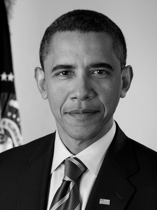
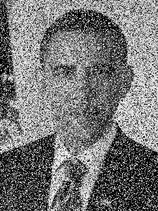
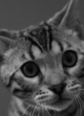
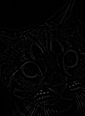
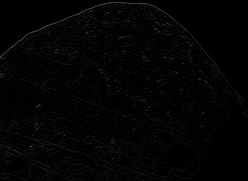
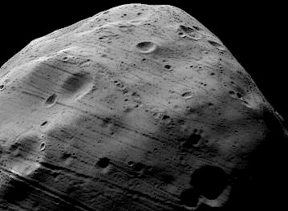

# Image Processing
Flip, blur, denoise, edge detection, sharpening of images

# Tutorial

Simply run ``python <py file>``

# Output

Original Image: 

Flip: 

Original Image: 

Denoise once: 

Denoise twice: 

Original Image: 

Edge detection: 

Original Image: 

Edge detection: 

Sharpening: 

